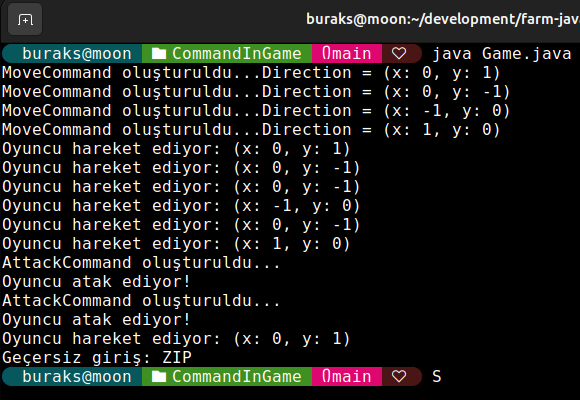
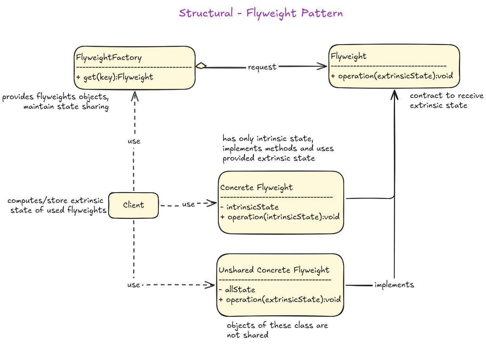
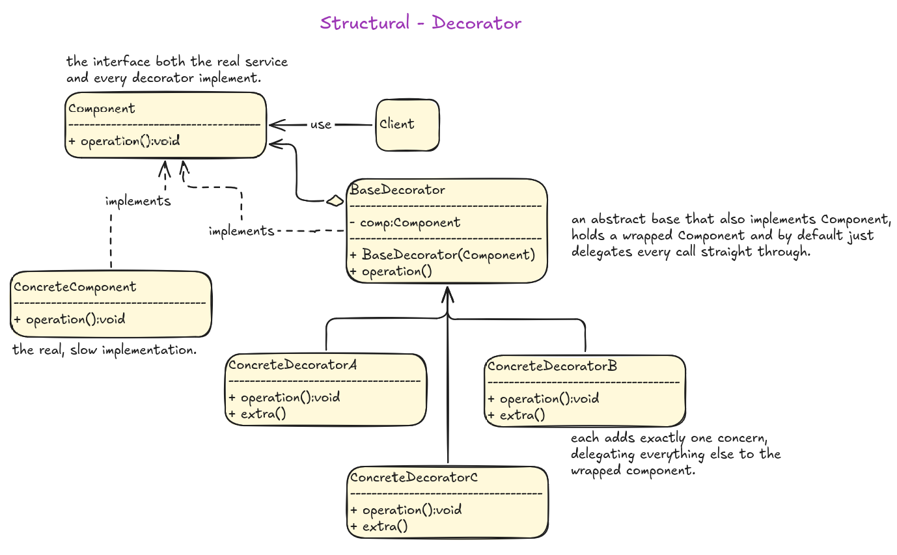
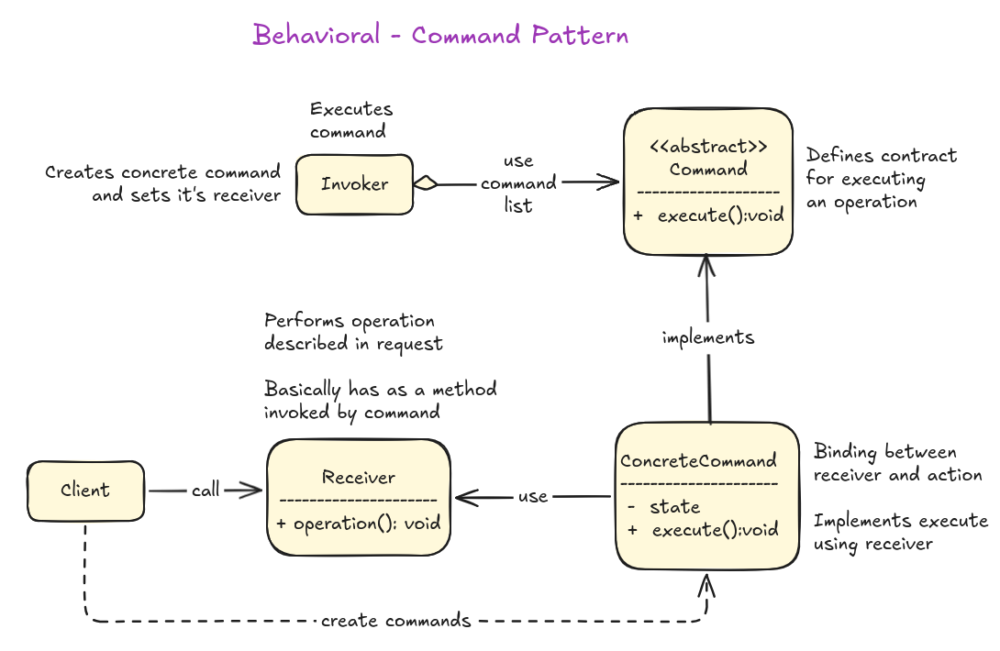
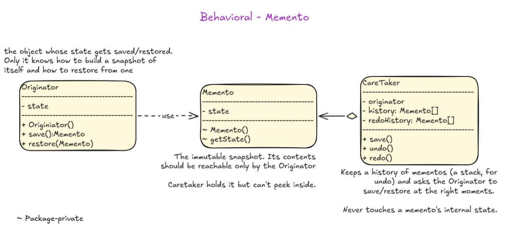

# Java ile Tasarım Kalıpları

Java programlama dili ile temel tasarım kalıplarının ele alındığı bireysel gelişim reposudur.

## Platform

Çalışma ortamı olarak emektar **Ubuntu (26.04)** sistemimi seçtim.

## Kurulumlar

```bash
sudo apt update
sudo apt install default-jdk maven

# Kontrol
java -version
javac -version
mvn -version

# Vs Code tarafı için gerekli eklenti
code --install-extension vscjava.vscode-java-pack
```

**Vs Code** tarafında bir Java projesi oluşturmanın en kolay yolu `Ctrl+Shift+P` sonrası `Java: Create Java Project` komutunu kullanmak.

## Startup

Örnekleri çalıştırmak için main fonksiyonunun olduğu programı çalıştırmanız yeterlidir. Örneğin

```bash
java Game.java
```



Yardımcı diagramlar.

## Creational Patterns - Builder


## Creational Patterns - Prototype


## Structural Patterns - Flyweight



## Structural Patterns - Decorator



## Behavioral Patterns - Command



## Behavioral Patterns - Strategy


## Behavioral Patterns - Observer


## Behavioral Patterns - Memento



## Yardımcı Kaynaklar

- [Java Programming Cheatsheet - Princeton University](https://introcs.cs.princeton.edu/java/11cheatsheet/)
- [Maven Central Repository](https://central.sonatype.com/)
- [Awesome Java](https://github.com/akullpp/awesome-java)
- [Useful Java Links](https://github.com/Vedenin/useful-java-links/)